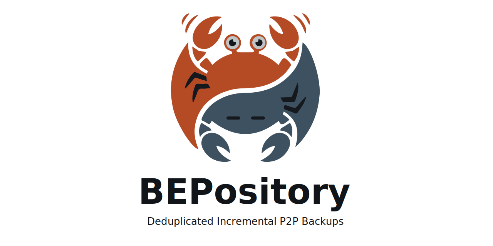

<!--
SPDX-FileCopyrightText: 2026 Brice Arnould

SPDX-License-Identifier: MIT OR Apache-2.0
-->

<p align="center">
  <picture>
    <source media="(prefers-color-scheme: dark)" srcset="img/bepository-logo-dark.svg">
    
  </picture>
</p>

# BEPository

**Deduplicated incremental backups with peer-to-peer sync between N hosts.**

`bepository` runs as a sidecar to [Syncthing](https://syncthing.net/) (on the
[same device](#how-it-works)) and gives it access to permanent storage (S3, GCS,
SFTP …), with snapshot support. Because it integrates with Syncthing, you get
all the benefits of Peer-to-Peer synchronisation.

**Use it to:**

- **Sync devices that are not online together.** Your laptop writes to cold
  storage; days later, your desktop reads from it.
- **Archive into cheap object storage** with automatic point-in-time checkpoints
  for recovery, block deduplication across files and snapshots.

> [!WARNING]
> **Pre-1.0:** The on-disk storage format is not yet stable. There are other
> important limitations, see the [corresponding section](#limitations).

## Features

- **Point-in-time recovery.** Automatic checkpoints (hourly for 24 h, daily for
  7 days by default) exposed over WebDAV.
- **Deduplication.** Identical blocks are deduplicated across files and
  snapshots.
- **Drop-in compatible.** Works as an add-on for existing Syncthing setups, and
  takes advantage of Syncthing features (read-only sources, write-only backups
  …).
- **Reasonably Fast.** A [Foyer](https://foyer.rs/) hybrid disk cache keeps
  bloom filters and indices local (default: `/var/cache/bepository`).

## Limitations

First and foremost, reliability:

- Not much field testing.
- Installation instructions are only tested on NixOS
  ([report success or failure](https://github.com/unbrice/bepository/issues)).
- On-disk format not stable yet (that will be 1.0).
- Partially implemented using LLMs. I've been careful to not trust it blindly
  and to be driving the session, please
  [report slop](https://github.com/unbrice/bepository/issues) if you see it.

On the feature front:

- Currently only the active host sees upload progress, other hosts see the
  `bepository` instance offline. Need to decide between:
  - A custom UI + a setting in Syncthing's configuration file to link to it.
  - Having the inactive processes report progress to their local Syncthing
    master.
  - Having the active process report progress to non-local Syncthing masters.
- Encryption support. Need to decide between:
  - Encrypting at SlateDB level, which allows deduplication to work at the
    folder level and keeps webdav working but requires custom crypto.
  - Relying on Syncthing's built-in encryption (more secure?).

Planned work is tracked in [ROADMAP.md](ROADMAP.md).

## Contributing

If you have insight into how to solve these problems, please do reach out.
Please *do not* send huge machine-generated PRs, let's discuss design first. I'm
well aware that Claude or Gemini would vibe-code a solution to the above, but
I'm trying to keep the codebase reviewable by humans.

Fellow nix users, a flake lives in `nix/dev`, use it with
`nix develop ./nix/dev`.

---

## How it works

```
╭──────────────────────────────────────╮       ╭────────────────────────────────────╮
│                Laptop A              │       │              Laptop B              │
│   ███████████████    ╭───────────╮   │       │   ╭───────────╮    ░░░░░░░░░░░░░░░ │
│   █  bepository █    │ syncthing │   │  P2P  │   │ syncthing │    ░  bepository ░ │
│   █  (active)   █◀━━▶│           │◀━━━━━━━━━━━━━▶│           │◀┈┈▶░  (standby)  ░ │
│   ███████████████    ╰───────────╯   │  SYNC │   ╰───────────╯    ░░░░░░░░░░░░░░░ │
│           ┃                          │       │                                ┊   │
╰───────────┃──────────────────────────╯       ╰────────────────────────────────┊───╯
            ┃ writes                                                            ┊ waits for
            ┃                   ▄▄▄▄▄▄▄▄▄▄▄▄▄▄▄▄▄▄▄▄▄▄▄                         ┊   lock
            ┗━━━━━━━━━━━━━━━━━━▶█      Snapshots      █┈┈┈┈┈┈┈┈┈┈┈┈┈┈┈┈┈┈┈┈┈┈┈┈┈┘
                                █   (AWS, GCS, ...)   █
                                ▀▀▀▀▀▀▀▀▀▀▀▀▀▀▀▀▀▀▀▀▀▀▀
```

*(Two laptops shown; any number of machines works.)*

- `bepository` runs on the same device as a regular Syncthing instance
  ([see FAQ](#running-on-different-device)).
- All durable state — identity, index, checkpoints — lives in the object store;
  hosts keep only a disposable cache. If a machine dies, install on a new one
  and point it at the same bucket.
- Multiple `bepository` instances can share the same object store. An
  epoch-based distributed lock ensures only the highest-priority instance writes
  at any time; the rest stay on standby and take over automatically if the
  active one loses its lease (e.g., after a long suspend).
- When multiple devices are online, they sync directly; `bepository` passively
  records changes and takes periodic checkpoints.
- A device coming back online syncs from `bepository` if no other peer is
  reachable — two laptops can stay in sync without ever being online
  simultaneously.

## Getting started

See [INSTALL.md](INSTALL.md) for the full guide:

1. Pick a storage backend (S3, GCS, SFTP …) and configure credentials.
2. On each device:
   1. Install the daemon (NixOS and source builds: [INSTALL.md](INSTALL.md)):

      ```sh
      curl -fsSL https://raw.githubusercontent.com/unbrice/bepository/master/install.sh | sh
      ```
   2. Pair it with your local Syncthing instance (see
      [FAQ for running on a different device](#running-on-different-device)).

## Point-in-time recovery

Checkpoints are taken automatically. To browse or download files from
checkpoints, set `BEPOSITORY_DAV_PASSWORD` in `/etc/bepository/env` and start
the WebDAV server:

```sh
bepository checkpoint serve 0.0.0.0:8080
```

Open `http://localhost:8080` in a WebDAV client (or a browser) and log in with
any username and the password you set. The server is read-only and takes no
distributed lock, so it can run alongside the daemon on any host with storage
credentials. Files are organised as:

```
/<folder-label>/<timestamp>/path/to/file
```

To adjust the checkpoint schedule:

```sh
# Keep hourly checkpoints for 48 hours instead of 24
bepository checkpoint every 1h ttl 2d

# Stop taking hourly checkpoints
bepository checkpoint every 1h remove

# List current schedules and existing checkpoints
bepository checkpoint list
```

## Maintenance

Run `fsck` to check and repair storage:

```sh
# Run a quick integrity check
bepository fsck --check quick
```

The `--check` levels are:

- `quick` — validates inbox entries and basic key structure.
- `structural` — additionally checks sequence mappings, index metadata, and
  directory block references.
- `full` — performs all checks including block hash verification.

<details>
<summary>Other commands</summary>

```sh
# Replace the TLS certificate (changes the Device ID — requires re-pairing)
bepository fsck --regenerate-id

# Force a full compaction
bepository fsck --compact

# Clear a stuck distributed lock (only when no instance is running)
bepository fsck --clear-lock
```

</details>

## FAQ

<a id="running-on-different-device"></a>

### Can Syncthing run on a different device?

Technically yes, but it is strongly recommended to run them together.
`bepository` does not implement relaying or discovery, meaning you would need a
fixed IP or domain and a clear line of sight between the devices. Furthermore,
each `bepository` process only accepts connections from a single Syncthing
instance ("`BEPOSITORY_MASTER_DEVICE_ID`" in the config).

### Do I need to open firewall ports?

No. `bepository` listens on loopback by default (`127.0.0.1:22001`) for its
local Syncthing instance, and implements no relaying or discovery. Only a
Syncthing master running on a *different* device needs a reachable address for
`bepository` — see the previous question.
